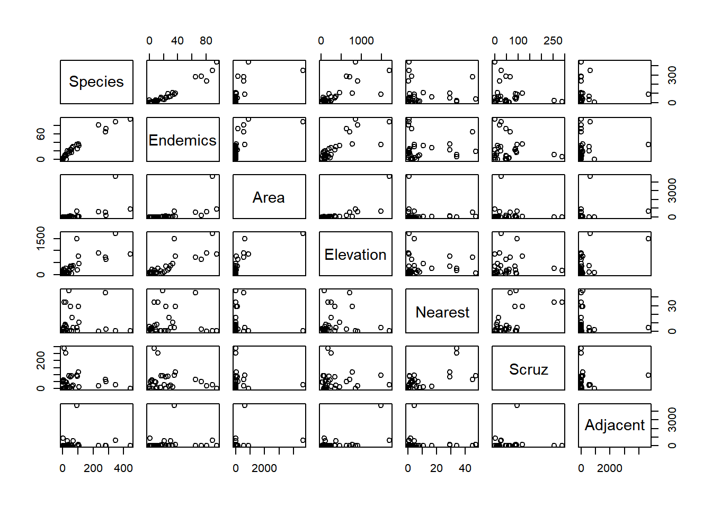

# Regresion


## Regresión Simple

## Regresión Multiple  
## REGRESION

	Las islas Galapagos constituyen un archipilago del oceano Pacifico ubicado a 972 km de la costa de Ecuador. Está conformado por trece islas grandes con una superficie mayor a 10 km^2, seis islas medianas con una superficie de 1 km a 10 km^2 y otros 215 islotes de tamaño pequeño. En la base de datos "gala" se encuentran la informacion de 30 islas e islotes de Galapagos y 7 variables en el conjunto de datos. Para el desarrollo de este punto:  
	
install.packages("faraway")  

library(faraway)  

```r
library(faraway)
```

```
## Warning: package 'faraway' was built under R version 4.0.2
```
Cargar el data frame. gala

```r
galapagos<- gala
head(galapagos,4)
```

```
##           Species Endemics  Area Elevation Nearest Scruz Adjacent
## Baltra         58       23 25.09       346     0.6   0.6     1.84
## Bartolome      31       21  1.24       109     0.6  26.3   572.33
## Caldwell        3        3  0.21       114     2.8  58.7     0.78
## Champion       25        9  0.10        46     1.9  47.4     0.18
```
###Descripción    
**Species**: a cantidad de especies de plantas encontradas en la isla  
**Endemics**: distribucion de especies que se encuentran confinados a un contorno geografico reducido, y que no se hallan de forma natural en ninguna otra region del mundo.    
**Atrea**: el área de la isla ($km^2$)   
**Elevation**: la elevacion mas alta de la isla (m)  
**Nearest**:la distancia desde la isla mas cercana (km)    
**Scruz**: la distancia desde la isla de Santa Cruz (km)  
**Adyacent**: el ?rea de la isla adyacente (km cuadrado)    
  
    
Cuál variable tiene una correlación más significativa con la variable especies?

```r
pairs(galapagos)
```



### Correlacion
 ¿Que tipo de pruebas debe realizar, antes de evaluar la correlación?   
 Teniendo en cuenta la correlación entre las variables especies y elevation, considera que es significativa?  
 
   

```r
cor(galapagos, method = "spearman")
```

```
##               Species    Endemics      Area  Elevation     Nearest      Scruz
## Species    1.00000000  0.95434807 0.8764471 0.75659444 -0.04169456 0.01658504
## Endemics   0.95434807  1.00000000 0.9239845 0.81460057 -0.04124404 0.04518642
## Area       0.87644710  0.92398447 1.0000000 0.89731895  0.10575007 0.21272808
## Elevation  0.75659444  0.81460057 0.8973190 1.00000000  0.10428984 0.09567249
## Nearest   -0.04169456 -0.04124404 0.1057501 0.10428984  1.00000000 0.58558128
## Scruz      0.01658504  0.04518642 0.2127281 0.09567249  0.58558128 1.00000000
## Adjacent   0.07789170  0.16746523 0.1869014 0.09956573 -0.09950916 0.12430393
##              Adjacent
## Species    0.07789170
## Endemics   0.16746523
## Area       0.18690143
## Elevation  0.09956573
## Nearest   -0.09950916
## Scruz      0.12430393
## Adjacent   1.00000000
```
Analice,interpreta y comente la correlación entre especies  y las otras variables    

Plantee las pruebas de hipotesis y ejecutelas en R para probar la significancia de la correlación de las variables explicativas con la variable dependiente: Especies

### Modelamiento  lineal 
Teniendo en cuenta, el conjunto de variables que podemos decir de las variables explicativas, segun la prueba F

```r
attach(galapagos)
modelo_completo<- lm(galapagos$Species~ galapagos$Area+galapagos$Elevation+galapagos$Endemics+galapagos$Nearest+galapagos$Scruz+galapagos$Adjacent)
summary(modelo_completo)
```

```
## 
## Call:
## lm(formula = galapagos$Species ~ galapagos$Area + galapagos$Elevation + 
##     galapagos$Endemics + galapagos$Nearest + galapagos$Scruz + 
##     galapagos$Adjacent)
## 
## Residuals:
##     Min      1Q  Median      3Q     Max 
## -68.219 -10.225   1.830   9.557  71.090 
## 
## Coefficients:
##                       Estimate Std. Error t value Pr(>|t|)    
## (Intercept)         -15.337942   9.423550  -1.628    0.117    
## galapagos$Area        0.013258   0.011403   1.163    0.257    
## galapagos$Elevation  -0.047537   0.047596  -0.999    0.328    
## galapagos$Endemics    4.393654   0.481203   9.131 4.13e-09 ***
## galapagos$Nearest    -0.101460   0.500871  -0.203    0.841    
## galapagos$Scruz       0.008256   0.105884   0.078    0.939    
## galapagos$Adjacent    0.001811   0.011879   0.152    0.880    
## ---
## Signif. codes:  0 '***' 0.001 '**' 0.01 '*' 0.05 '.' 0.1 ' ' 1
## 
## Residual standard error: 28.96 on 23 degrees of freedom
## Multiple R-squared:  0.9494,	Adjusted R-squared:  0.9362 
## F-statistic: 71.88 on 6 and 23 DF,  p-value: 9.674e-14
```

 Lo anterior permite pensar en un modelo que permita expresar la variable especie en funcion de las variables explicativas por que ?  
   
Por que la única variable significativa es endemicas en el modelo completo?  

 
### Modelo1: Regresion Lineal Simple    

  
  $y_i=\beta_{0}+\beta_{1}x_{i}+e_{i}$  

```r
modelo1<-lm(galapagos$Species~galapagos$Elevation)
summary(modelo1)
```

```
## 
## Call:
## lm(formula = galapagos$Species ~ galapagos$Elevation)
## 
## Residuals:
##      Min       1Q   Median       3Q      Max 
## -218.319  -30.721  -14.690    4.634  259.180 
## 
## Coefficients:
##                     Estimate Std. Error t value Pr(>|t|)    
## (Intercept)         11.33511   19.20529   0.590     0.56    
## galapagos$Elevation  0.20079    0.03465   5.795 3.18e-06 ***
## ---
## Signif. codes:  0 '***' 0.001 '**' 0.01 '*' 0.05 '.' 0.1 ' ' 1
## 
## Residual standard error: 78.66 on 28 degrees of freedom
## Multiple R-squared:  0.5454,	Adjusted R-squared:  0.5291 
## F-statistic: 33.59 on 1 and 28 DF,  p-value: 3.177e-06
```
## Ejercicio:    
a. Escriba el modelo  
b. Interprete la pendiente y el intercepto  
c. Es significativa la variable elevacion por que?  
d. Cuánto de la variable elevación aporta a la explicación de elevación.  
e. Realice un grafico donde se muestre el ajuste del modelo 1  

f.Verifique si los residuos del modelo 1 cumplen con las condiciones para que el modelo sea valido  

g. Verifique un segundo modelo2 utilizando las variables elevacion y área y compararlo con los modelos anteriores.  
h. Analice las condiciones del modelo multiple   

j. Corra el modelo propuesto por los autores y verifique sus resultados. Qué transformación se realizo y porque?
   
   


 


## Regresión Logistica

## Regresión Probit
